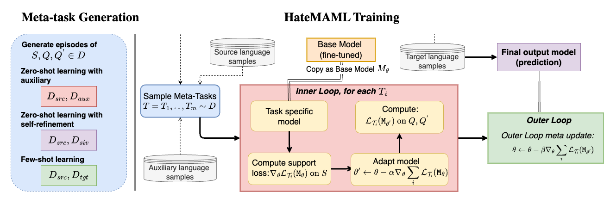
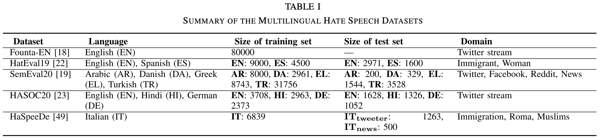

# Model-agnostic meta-learning for multilingual hate speech detection
Rabiul Awal, Roy Ka-Wei Lee, Eshaan Tanwar, Tanmay Garg, Tanmoy Chakraborty


## Approach
We propose [HateMAML](https://ieeexplore.ieee.org/abstract/document/10100717), a model-agnostic meta-learning-based framework that effectively performs hate speech detection in low-resource languages. HateMAML utilizes a self-supervision strategy to overcome the limitation of data scarcity and produces better LM initialization for fast adaptation to an unseen target language (i.e., cross-lingual transfer) or other hate speech datasets (i.e., domain generalization). 



## Datasets Overview


To process the datasets:
1. Place the raw pickled Pandas [DataFrame](https://pandas.pydata.org/docs/reference/api/pandas.DataFrame.html) at directory `data/raw/`. This DataFrame is expected to be in the format as described in `data/raw/README.md`.
2. Execute `scripts/prepare_data.sh` to convert raw dataset to processed dataset.
3. Load this processed data to run the scripts in `src` dir.


## Variants of HateMAML

- **HateMAML (zero-shot)**: This is similar to X-MAML, but it uses both source and auxiliary languages for meta-training, while X-MAML only uses auxiliary language samples.
- **HateMAML (self-training)**: Choose a target language for selftraining on silver data. First, we generate silver labels and keep only 300 samples. Next, we apply HateMAML in an iterative manner to the silver-labeled data from the target language as explained in Section III-D.
- **HateMAML (fine-tune)**: We generate meta-task from a set of available languages and apply HateMAML. This is very similar to fine-tuning aggregated training examples from the selected language set. 


## Usage Instructions

### Fine-tuning baselines
To fine-tune baseline models, use the scripts provided in scripts/finetune.sh.

For example, to fine-tune the English dataset using the XLM-RoBERTa pre-trained model:
```
MODEL_PATH=xlm-roberta-base
BATCH=32
LR=5e-5
DATASET=founta
FT_CHOICE=fft
python3 src/maml/finetune.py --source_lang en --target_lang en --num_train_epochs 7 --meta_lr $LR \
--seed 1 --model_name_or_path $MODEL_PATH --device_id 1 --batch_size $BATCH  --dataset_name $DATASET \
--finetune_type $FT_CHOICE
```

### Fine-tuning Hate-MAML 
For HateMAML experiments, follow the scripts in scripts/meta_train.sh corresponding to Tables II, III, and IV in our paper.

For instance, fine-tuning in a zero-shot setting as per Table II:
```
MODEL_PATH=xlm-roberta-base
EXP_SETTING=hmaml_scale
BATCH=32
SHOTS=32
BASE_DATASET=founta
DATASET=semeval2020
SAMPLE_SZ=500
TYPE=zeroshot
python3 src/maml/hmaml_mixer.py --source_lang en --aux_lang $A_LANG --target_lang $T_LANG --num_train_epochs 5 \
--num_meta_iterations $M_EPOCHS --meta_lr $LR --fast_lr $FAST_LR --seed $ID --model_name_or_path $MODEL_PATH \
--base_model_path runs/finetune/${BASE_DATASET}/en/en_ft/${MODEL_TYPE}/seed1 --shots $SHOTS --batch_size $BATCH \
--exp_setting $EXP_SETTING --device_id 0 --dataset_name $DATASET --num_meta_samples $SAMPLE_SZ --metatune_type $TYPE
```


## Citation
If you use this code, please cite our paper:
```
@article{awal2023model,
  title={Model-agnostic meta-learning for multilingual hate speech detection},
  author={Awal, Md Rabiul and Lee, Roy Ka-Wei and Tanwar, Eshaan and Garg, Tanmay and Chakraborty, Tanmoy},
  journal={IEEE Transactions on Computational Social Systems},
  year={2023},
  publisher={IEEE}
}
```